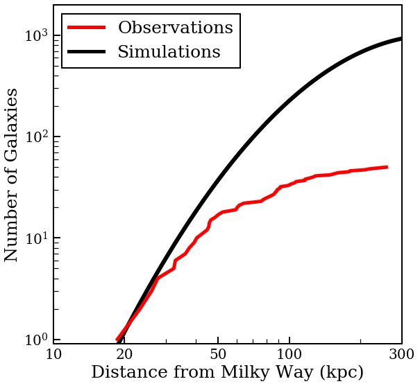

This is a repository based on a student in my research group making a comment that the code being used took a few days to run. Based on what was trying to be accomplished, that sounded like an unreasonable amount of time and offered to take a look. We went through the code together in two iterations and I hope to capture and share that interaction because I see these tendencies often.

## Astronomy Background

The code being presented here deals with a quantity in astronomy called the correction factor (which is just a way of saying we know we don't have the right answer, but we think we can get close). This correction factor is correcting our counts of small galaxies in the Milky Way's neighborhood. Smaller galaxies are less bright making them harder to see on the night sky. What this means for observations is that galaxies that are very close tend to be seen easier than those farther away. We can account for this [observational bias](https://en.wikipedia.org/wiki/Malmquist_bias) by looking at numerical simulations of the Milky Way and count the number of galaxies of a given mass for a bunch of different distances from the Milky Way. Comparing the simulations to what we observe results in a plot similar to the one below: 

 

The correction factor is what astronomers use to inform their predictions for the number of galaxies around the Milky Way and, by extension, other galaxies like ours.

## Original Code

The [original code](/corr_factors.py) was written with the goal of using data from the [ELVIS](http://localgroup.ps.uci.edu/elvis/) suite of simulations to determine the correction factors for various galaxies around the Milky Way. The goal was to perform mock observations within the simulation and compare them to the true observations -- their ratio being the correction factor. An outline of the code is as follows:
* Overall setup (load data and establish constants)
* Obtain a random orientation of the mock observations
* Calculate the observational cones (volume observed by the DES and SDSS surveys)
* Return the ratio of galaxies within the cones to total galaxies
* Repeat for various orientations of cones, simulation versions, and mass constraints

This student has just started learning Python and tackled this problem in a very logical way using `for` loops. `for` loops by themselves aren't problematic, but having multiple nested loops can become an issue. A general rule of thumb is that when you start nesting loops, there is probably a better way to do it.

In this case, we're looping through all the simulation versions, looping through each orientation of the cones, and looping through each row (galaxy) in the dataset. That's a lot of loops and it's no wonder this was taking days to complete.

## First Optimization

The [first iteration](/corr_factors_fns.py) cleaned the code a bit to make it easier to debug and abused vectorization to take care of the 3rd `for` loop (examining each galaxy in the dataset at once) in the original code. The major changes here are: 
1. Removing the loop through each galaxy. This is fairly straight forward using Numpy as it natively performs operations elementwise on arrays.
2. Addition of a command-line parser ([sys.argv](https://stackoverflow.com/questions/4117530/sys-argv1-meaning-in-script)) to allow certain quantities to be passed in without editing the source file
3. Consolidation of code into functions
4. Introduction of boolean masks to make the logic easier to follow

## Second Optimization

The [second iteration](/corr_factors_mat.py) abstracted the loop through the orientations of the cones into a matrix where the rows are the galaxies and the columns are the different orientations of the cones.
